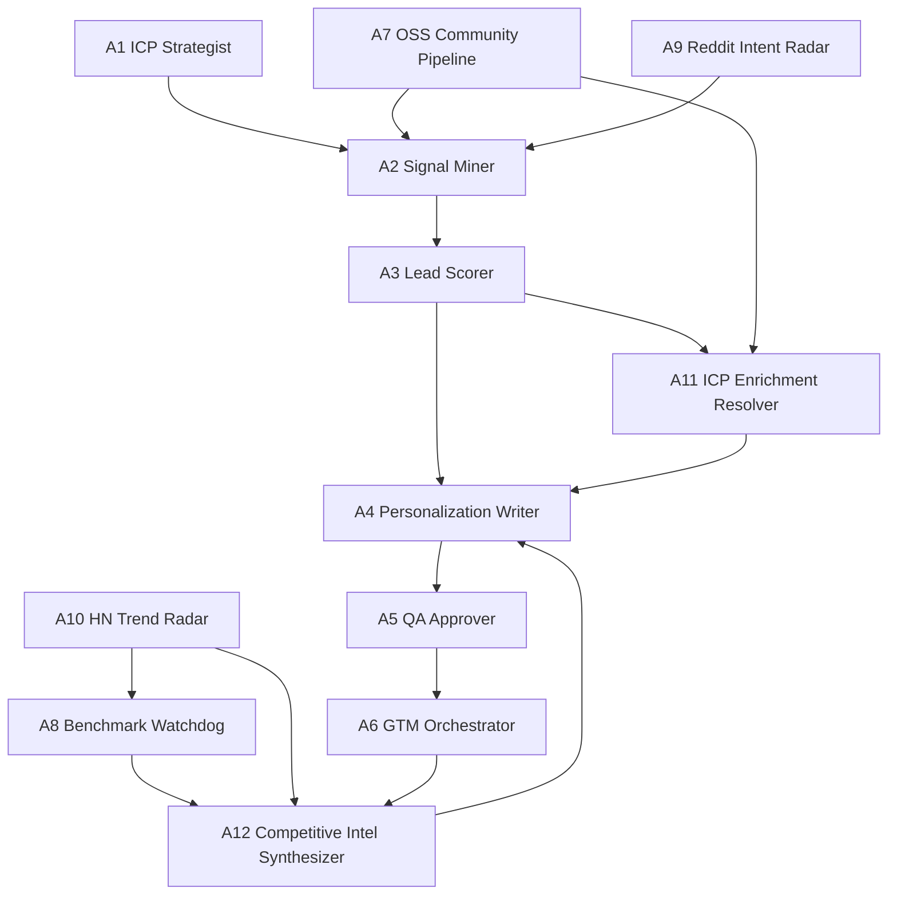

# MiroThinker GTM Agent System (Interview Build)

This repo contains a **verification-first multi-agent GTM system** for MiroThinker.

It includes:
- a core 6-agent orchestrated workflow,
- 6 extension agents for community + benchmark + intel signals,
- machine-auditable JSON artifacts at every stage,
- HTML visualizations for interview walkthroughs,
- a one-click deployable bundle.

## Live demo (clickable)

- Public walkthrough: [https://interview-bundle.vercel.app](https://interview-bundle.vercel.app)
- Functional map: [https://interview-bundle.vercel.app/artifacts/mirothinker-agent-functional-map.html](https://interview-bundle.vercel.app/artifacts/mirothinker-agent-functional-map.html)
- Step-by-step execution trace: [https://interview-bundle.vercel.app/artifacts/mirothinker-step-by-step-execution.html](https://interview-bundle.vercel.app/artifacts/mirothinker-step-by-step-execution.html)
- Dependency graph: [https://interview-bundle.vercel.app/artifacts/mirothinker-12-agent-graph.html](https://interview-bundle.vercel.app/artifacts/mirothinker-12-agent-graph.html)
- Full audit page: [https://interview-bundle.vercel.app/artifacts/mirothinker-gtm-full-walkthrough.html](https://interview-bundle.vercel.app/artifacts/mirothinker-gtm-full-walkthrough.html)

## What was actually run (latest)

Latest core run: `2026-04-13T02:05:21Z`
Latest extended run: `2026-04-13T02:05:52Z`

- Core source batch: **25** leads
- Core accepted/rejected: **17 / 8**
- Drafts generated: **12**
- QA approved/rejected: **12 / 0**
- Dedupe check (second run new leads): **0**
- A7 OSS prospects ranked: **20** (from 60 stargazers; 41 enriched)
- A8 benchmark threats: **3**
- A9 Reddit high-intent: **0** (this run)
- A10 HN trend threads: **28**
- A11 enriched records: **17**
- A12 high competitor threats: **0**

## Agent architecture (12 total)



## Agent-by-agent responsibilities + filters

### Core agents (A1-A6)

1. **A1 ICP Strategist** (`scripts/miro_gtm_agent_team.py`)
   - Defines ICP segments, ideal seniority keywords, exclusion keywords, preferred regions.
   - Sets `minimum_score_to_contact = 45`.

2. **A2 Signal Miner** (`scripts/miro_gtm_agent_team.py`)
   - Converts raw leads into normalized signals:
     - keyword matches,
     - role signal (decision-maker vs practitioner),
     - region preference,
     - profile presence.

3. **A3 Lead Scorer** (`scripts/miro_gtm_agent_team.py`)
   - Deterministic scoring formula:
     - `+30` senior title keyword
     - `+10` per matched signal keyword (cap `+30`)
     - `+10` preferred region
     - `+5` has LinkedIn profile
     - `-15` if company has `university`
     - `-50` if exclusion keyword in name/title (`student`, `intern`, `recruiter`, `advisor`)
   - Accept if `score >= 45`.
   - Bands: A (`>=65`), B (`>=45`), C (`<45`).

4. **A4 Personalization Writer** (`scripts/miro_gtm_agent_team.py`)
   - Generates personalized email + per-lead blog angle.
   - Draft cap: top 12 accepted leads.

5. **A5 QA Approver** (`scripts/miro_gtm_agent_team.py`)
   - Reject criteria:
     - missing prospect name,
     - missing company context,
     - too short (`<40` words),
     - hype words (`guaranteed`, `instantly`, `revolutionary`).
   - Retry path: one rewrite pass, then approve/reject.

6. **A6 GTM Orchestrator** (`scripts/miro_gtm_agent_team.py`)
   - Enforces chain order and validation gates:
     - happy path,
     - quality gate,
     - dependency block simulation,
     - dedupe determinism.

### Extension agents (A7-A12)

7. **A7 OSS Community Pipeline** (`scripts/miro_gtm_extended_agents.py`)
   - Source: GitHub stargazers + profile enrichment.
   - Tier scoring (0-10): company, tier-1 company signal, influence, domain bio keywords.

8. **A8 Benchmark Signal Watchdog** (`scripts/miro_gtm_extended_agents.py`)
   - Source: HN benchmark queries + arXiv query.
   - Threat event when engagement crosses threshold (e.g., HN points >= 40).

9. **A9 Reddit Intent Radar** (`scripts/miro_gtm_extended_agents.py`)
   - Source: Reddit search.
   - Intent score from language signals (`problem/pain`, `verify/compliance/risk`, `looking for/alternative`).

10. **A10 HN Trend Radar** (`scripts/miro_gtm_extended_agents.py`)
    - Source: HN Algolia keyword radar.
    - Dedupes by story id; ranks by points/comments.

11. **A11 ICP Enrichment Resolver** (`scripts/miro_gtm_extended_agents.py`)
    - Joins accepted leads to source CSV metadata.
    - Adds domain/persona fields for stronger personalization.

12. **A12 Competitive Intel Synthesizer** (`scripts/miro_gtm_extended_agents.py`)
    - Combines A8 + A10 signals into competitor threat levels and counter-positioning guidance.

## Step-by-step runbook

### Option A (recommended for interviewers, no API keys required)

From repo root:

```bash
python3 scripts/run_portable_validation.py
```

This validates and rebuilds the interview bundle from committed artifacts + a committed source-lead fixture.

### Option B (full live run with APIs)

```bash
# 1) Generate latest source leads (requires API credentials in .env)
python3 skills/capabilities/crustdata-supabase/scripts/prospect_search.py \
  --config skills/capabilities/crustdata-supabase/configs/mirothinker.json \
  --yes

# 2) Run core + extension agents
python3 scripts/miro_gtm_extended_agents.py

# 3) Build pages + portable bundle
python3 scripts/render_miro_workflow_drilldown.py
python3 scripts/render_miro_full_audit_html.py
python3 scripts/render_agent_functional_map.py
python3 scripts/render_execution_provenance.py
python3 scripts/build_interview_bundle.py
python3 scripts/render_human_friendly_frontpage.py

# 4) Optional deploy
bash scripts/one_click_vercel_publish.sh
```

## Output artifacts (machine-auditable)

- Core artifacts: `output/agent-team`
- Extended artifacts: `output/agent-team-extended`
- Interview bundle: `output/interview-bundle`

Most important files:
- `output/agent-team/06_manager_summary.json`
- `output/agent-team/mirothinker-workflow-drilldown.html`
- `output/agent-team/mirothinker-gtm-full-walkthrough.html`
- `output/agent-team-extended/run_summary.json`
- `output/agent-team-extended/dependencies.json`
- `output/agent-team-extended/mirothinker-agent-functional-map.html`
- `output/agent-team-extended/mirothinker-step-by-step-execution.html`
- `output/interview-bundle/index.html`

## Why only 25 leads in core input?

Because the core pipeline currently consumes the latest available CrustData CSV batch (`25` records in this run).

How to increase volume to 200+:
- run multi-page fetch in CrustData (not one-page/test mode),
- widen filters (titles, geos, keyword buckets),
- merge A7 and A9 net-new leads into the scored lead table,
- write net-new leads back to Supabase in larger batches.

## Notes for external validators

- This repo includes both code and generated run artifacts.
- Core pipeline has a committed fallback fixture at `scripts/fixtures/mirothinker-source-leads.csv`, so a fresh clone can run without private data pulls.
- You can rerun end-to-end with the runbook above.
- If API credits are exhausted (e.g., CrustData), core volume will not increase until credits are restored.
